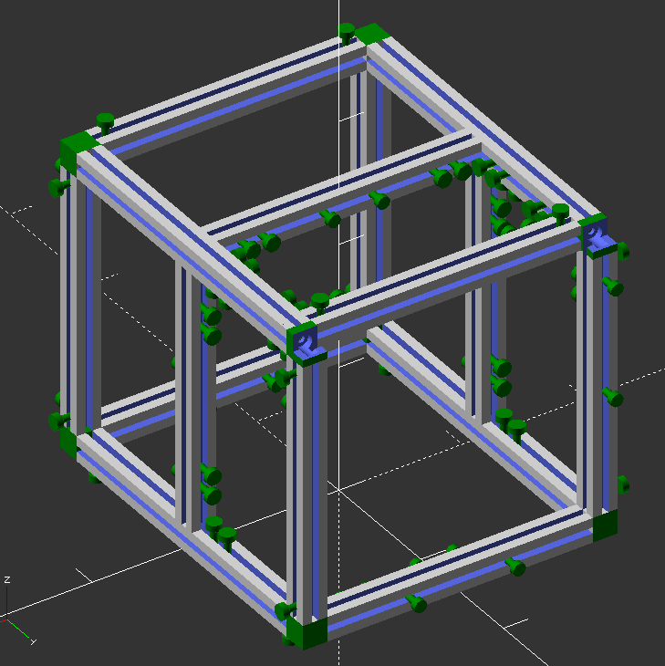
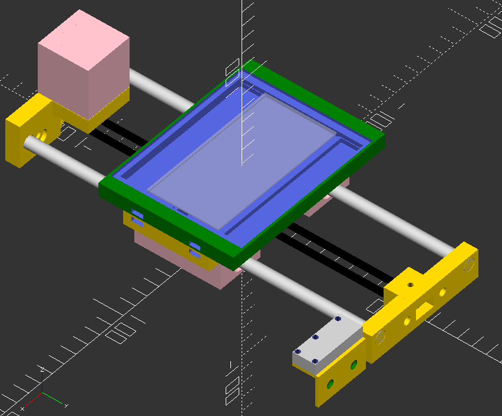
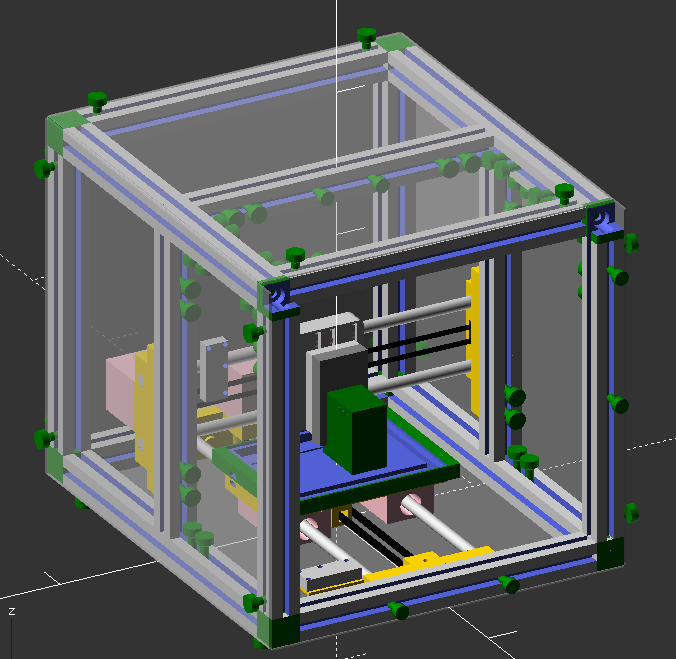
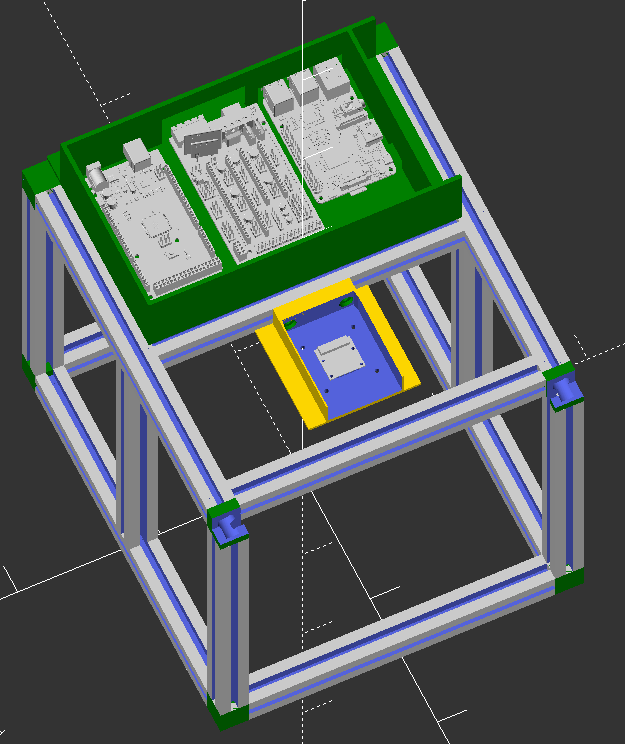
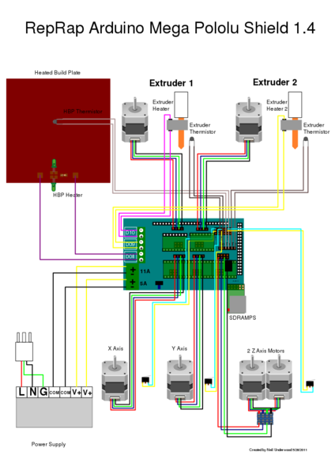
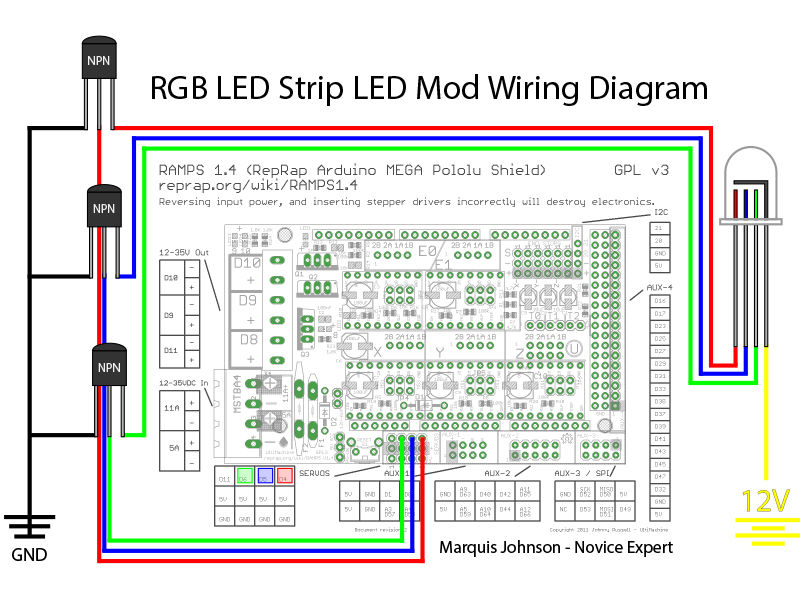
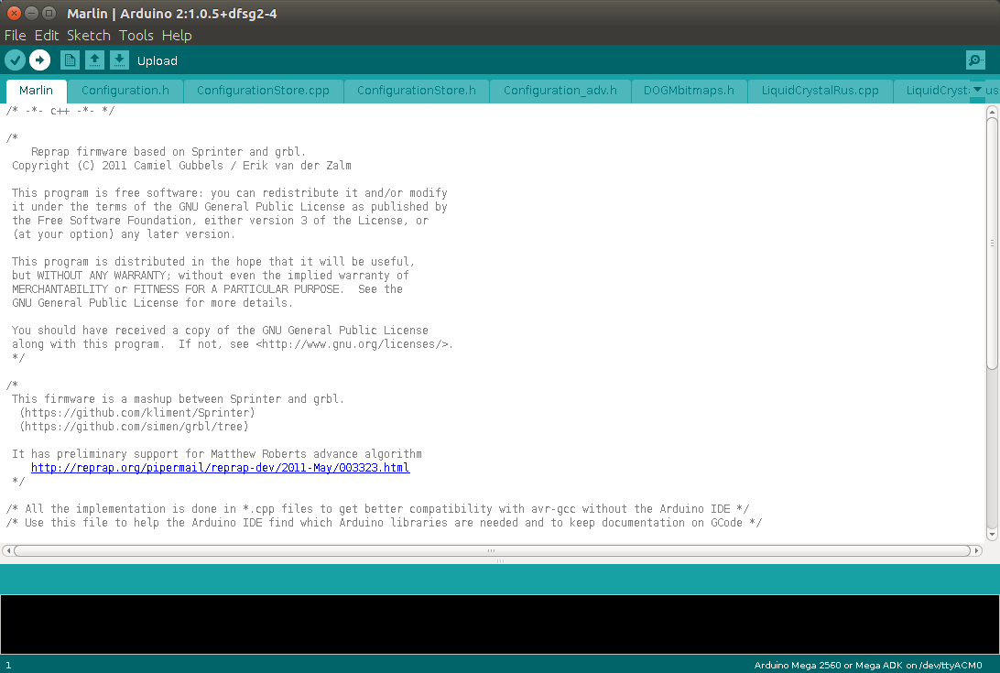
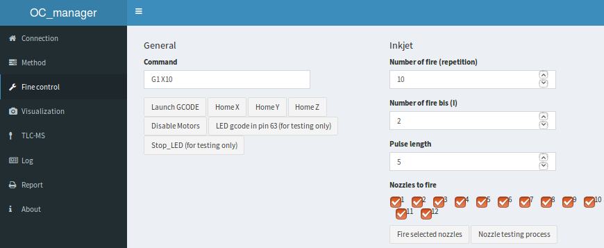

```{r setup, include=FALSE}
knitr::opts_chunk$set(echo = F)
library(knitr)
library(readxl)
```

## Usefull ressources

Some knowledge are mandatory to build this device. The following links should give an overview. Over this document, it is assumed that you know the content of those ressources.

3D printing:

* [Reprap project](http://reprap.org/wiki/RepRap)
* [Gcode listing](http://reprap.org/wiki/G-code)
* [Course on 3D printing](https://www.coursera.org/learn/3d-printing-revolution)

Information on each electronic board used:

* [Ramps board](http://reprap.org/wiki/Ramps) (electronic of our machines)
* [Inkshield board for inkjet](http://nicholasclewis.com/projects/inkshield/theory/), more info from people who used the board [here](http://www.instructables.com/id/DIY-BioPrinter/), [here](http://garyhodgson.com/reprap/2012/04/inkshield-trying-to-run-before-i-can-walk/), [here](https://github.com/sjkelly/AMRI-Rice-201308-sjkelly). [Place to buy the cartridge](https://www.ebay.com/itm/Lot-of-200-Empty-Virgin-HP-C6602-Black-Ink-Cartridges-/151788284399)
* [Raspberry pi project](https://www.raspberrypi.org/)
* [Arduino project](https://www.arduino.cc/) (see [those courses](https://www.coursera.org/specializations/iot) for an introduction on the Internet of things)

Some software to install:

* [Openscad software](https://cubehero.com/2013/11/19/know-only-10-things-to-be-dangerous-in-openscad/) (for drawing, see [this tutorial](https://cubehero.com/2013/11/19/know-only-10-things-to-be-dangerous-in-openscad/))
* [Slic3r software](https://github.com/prusa3d/Slic3r/releases) (to create Gcode file for 3d printing, [here is the main page](http://slic3r.org/) but it's better to install the Prusa edition)
* [Arduino IDE](https://www.arduino.cc/en/Main/Software) (to modify and upload the [marlin firmware](http://marlinfw.org/))

Others:

* [Instructable for LED control from the RAMP](http://www.instructables.com/id/3D-Printer-RGB-LED-Feedback/)

\pagebreak

## Print the parts

### SCAD folder

SCAD file: __full_view("printed")__.

SCAD files can be found in the SCAD fodler, normally, only the file OCLab.scad is of interest. Each different module can be observed separatly by changing the argument of the ```full_view``` module.

### STL folder

The STL files in this folder contain several files, only the file ```OCLab.stl``` should be considered up to date. Parts are designed to be printed on a Prusa i3 MK2 with the _0.35mm fast_ setting. Normally, no supports are needed but a brim could be usefull. Be sure to rotate the part so they print correctly.

## Bill of material

\tiny


```{r}
data = as.data.frame(read_excel("../BOM_OCLab.xlsx"))
kable(data[1:(nrow(data)-1),],caption = paste0("Bill of material - Estimated total price: ",data[nrow(data),4], " Euro (VAT)"))
```

\normalsize

\pagebreak

## Frame

SCAD file: __full_view("frame")__.

Needed parts:

* 76x M5 nuts
* 20x20 profiles
* 6x 20x20 cube connectors
* 10x 20x20 angle connectors
* M5 screw for cube connector (sold with it normally)
* M5*10 screw for angle connectors
* printed parts: ```feets```; ```green_top_front```
* closing plates

Before assembling the frame, set the nuts to have one nut for each M5 screw shown in Figure \ref{figureFrame}. There is 76 in total.

The plate to close the box can be added now or later but can make the assembly difficult, worth case scenario, they are put to early and need to be dismounted to grant access.

{width=50%}

\pagebreak

## Y axis

SCAD file: __full_view("Y axis")__.

Needed parts:

* 2x 8mm rods
* 4x lm8uu bearing
* 4x lm8uu housing
* 2x 623zz bearing
* 1x endstop
* 1x nema14
* 1x gt2 pulley
* printed parts: ```Y_endstop_holder```, ```Y_moving```, ```plate_holder```, ```Y_end``` and ```Y_motor```
* 8x magnets
* 16x M4x20
* 3x M3x30
* 4x M3x16
* 2x M3x10

Assemble the Y axis as in Figure \ref{figureYaxis}. Start by the ```Y_moving``` part, screw the lm8uu housing (with the lm8uu in). For the belt holder, be carrefull with the direction, it can be changed when the belt will be tightned during the assembly to the frame if needed. 

Pull the magnets in the ```Y_moving``` part and the ```plate_holder``` part, be careful with the direction.

Insert the rods in the lm8uu housing. The rods must then fit in the ```Y_end``` and ```Y_motor``` parts, if not, drill a 8mm hole.

The endstop must be screw to the ```Y_endstop_holder``` can be put appart for the moment and will be set during the assembly.

{width=50%}

\pagebreak

## X axis

SCAD file: __full_view("X axis")__.

Needed parts:

* 2x 8mm rods
* 4x lm8uu bearing
* 2x 623zz bearing
* 1x endstop
* 1x nema14
* 1x gt2 pulley
* printed parts: ```X_motor```, ```X_end```, ```X_moving```, ```HP_C6602_holder_holder```, ```X_end_stop_holder```
* HP C6602 holder
* 2x M4x20 
* 2x M4 nut
* 1x M3x30
* 4x M3x10
* 2x M2*10 
* 1x M3 nut
* 2x M2 nut

{width=50%}

Assemble the ```X_motor```, ```X_end``` and ```X_moving``` parts as for the Y axis.

The link between the ```HP C6602 holder``` and ```X_moving``` is made by the ```HP_C6602_holder_holder``` part, use M4 and M2 screws and nuts for this. M4 link to the ```X_moving``` and M2 to the ```HP C6602 holder```.

\pagebreak

## Axis assembly


SCAD file: __full_view("assembled")__.

Needed parts:

* X axis
* Y axis
* frame
* 10x M5
* belts

Position the X axis and Y axis as in Figure \ref{figureAssembled}. The belt must be tightned and blocked with zip-ties.

The X axis must be position as low as possible while avoiding colision with the plate hodler. The Y axis will be positioned later when the cartridge will be able to fire.


{width=50%}

\pagebreak

## Electronique

SCAD file: __full_view("elec")__.

Needed parts:

* printed parts: ```elec_holder```, ```camera_holder```
* raspberry pi
* arduino mega
* ramsp 1.4
* 2x A9688 motor drivers
* LED strip
* Prototype soldering plate
* 3x NPN transistor 2n3904h33
* Breadboard Jumper Wires Ribbon Cable 
* 6x M3x20 screws
* 8x M2x10 screws
* 8x M2 nuts
* 255 nm LEDs

Solder the inkshield board as shown on the [website](http://nicholasclewis.com/projects/inkshield/assembly/).

Mount the UV LED to an appropriate board (screw distance 35.5mm, hole for camera lens centered in the middle) and connect it to the ```camera_holder```.

Follow [this instructable](http://www.instructables.com/id/3D-Printer-RGB-LED-Feedback/) to make the electronic for the RGB LED strips. The LED strips must be attached with double side tape to the ```camera_holder``` part.

Screw the arduino/ramps and inkshield boards to the ```elec_holder``` part and mount it in the frame as in Figure \ref{figureElectronique}. Plud the motor driver in the X and Y axis positions.

{width=50%}

\pagebreak


## Wiring

The scematic of the ramps is the presented in Figure \ref{figureRamp}.

{width=40%}

### Motors and endstop

Wire the ramps board as in the Figure \ref{figureMotorWiring}. Only the X and Y motor are used, including their respective endstops. Note that this figure is extracted from a 3D printer wiring.

{width=40%}

### LEDs

Wire the RGB LED as in Figure \ref{figureLEDWiring} with the difference that "Red" = 44,"Green"=66,"Blue"=64. Again, go back to [the instructable](http://www.instructables.com/id/3D-Printer-RGB-LED-Feedback/) if needed and refer to Figure \ref{figureRamp}.

For the UV LEDs, a separated power supply is necessary and it cannot be controled by the software. If a solution is found, the pin 59 is reserved for the 255 nm LED.

{width=40%}

### Inkshield board

Similarly to the RGB LEDs, connect the inkshield board with ribbon female-female cable. The auxiliary input must be used and the connections are: "A"= 11,"B"= 6,"C"= 5,"D"= 4,"pulse"=63. The 12V, 5V and ground can be taken from the Ramps and RGB LED board.


\pagebreak


## Software set up

### Uploading the firmware

Use the [Arduino IDE](https://www.arduino.cc/en/Main/Software) to upload the Marlin firmware present in the github repository to control the board. Open the ```Marlin.ino``` file and flash the firmware on the board while connected to usb (Figure \ref{figureMarlin}).

{width=40%}

### Flash the sd card for the raspberry pi

Follow [online instruction](https://www.raspberrypi.org/documentation/installation/installing-images/) to flash the sd card on the raspberry pi (a sd card with everything set up is planned but not yet available). In the mean time, use the latest version of rasbian.

It is necessary to set a static IP address for the pi. As this is done differently depending of rasbian version, look for an up to date answer online. Once the SD card is flashed, the raspberry pi can be screwed in the ```elec_holder``` part.

### OC manager

Follow the instruction on the github repository of [OC_manager](https://github.com/DimitriF/OC_manager). Steps could be missing and feedback are more than welcome. As a rule of thumb, a rapid google search with the error message can solve most problem.

\pagebreak

## Calibration

The only calibration necessary is to position correctly the Y axis. To do so:

* Open OC_manager by going in your browser on the IP address of the raspberry pi, 
* Connect the board
* In the Fine control tab (Figure \ref{figureOC}): home the X axis and the Y axis, (if the motor are not in the good direction, turn off the full system and simply reverse the cable on the ramp)
* With an ink cartridge in the cartridge holder and a plate in the 10x10 cm plate holder, click on ```fire selected nozzles```. The 12 ink droplets must be on the plate in the top left corner. Move the Y axis if necessary.

This calibration procedure is not enough and is a known problem, ideally, a complementary procedure should be inserted in the code to add a bias in X and Y to every movement. The 3D printing environment was done to have reproducible movement __during the print__ and not between print.

{width=40%}

