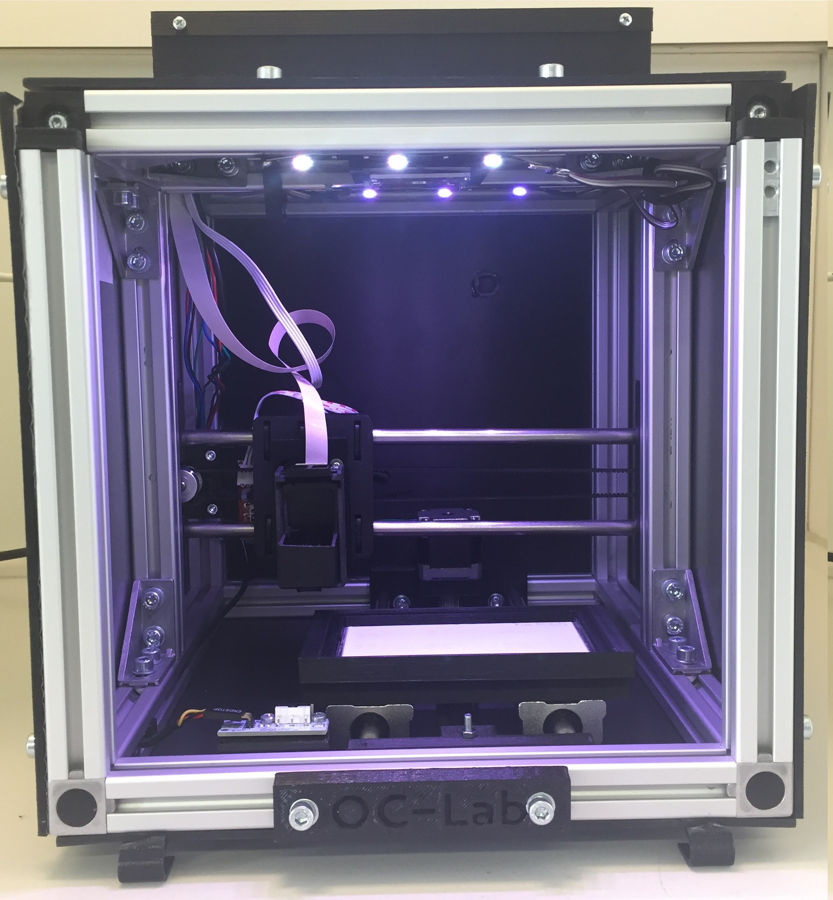

# OCLab

All-in-One Open-Source System for Planar Chromatography

This reprository contain all information to build an office chromatography (OC) system.

## Marlin forlder

The firmware is in this folder and can be uploaded to the arduino via the arduino IDE.

## OC manager

The system is controled by [OC_manager](https://github.com/DimitriF/OC_manager). Follow the instruction from this github repository to install it on a linux system (raspberry pi for example). We plan to distribute an image that can be flashed on a SD card.

## Instruction

Instruction for assembly can be found in the ```Instruction``` folder. In addition, a video can be found on [youtube](https://www.youtube.com/watch?v=E2v-KFa0v40&t=). The bill of material is in ```BOM_OCLab.xlsx``` file.


